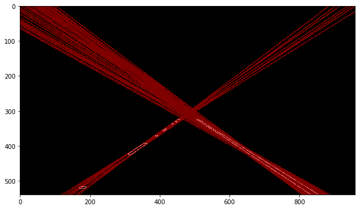

#**Finding Lane Lines on the Road** 

##Project Writeup

The goals / steps of this project are the following:
* Make a pipeline that finds lane lines on the road
* Reflect on your work in a written report

---

### Reflection

####1. Describe your pipeline. As part of the description, explain how you modified the draw_lines() function.

For the pipeline, I took a slightly different approach, I used `HoughLines` instead of `HoughLinesP`.  The steps of the pipeline are as follows:

* Convert to grayscale
* Apply Gaussian blur and Canny to detect edges
* Call HoughLines on the region of interest, which returns _(rho, theta)_ of all detected lines
* Organize the lines into groups with similar _(rho, theta)_; average the lines in each group.  I then have the final list of _(rho, theta)_ corresponding to the most prominent lines in the image, which should concide with the lane lines
* Pick the two lines with the largest positive and negative slopes

With this approach, I end up with full lines desribing the lanes and don't need to do any extrapolation of line segments.

Result of HoughLines before grouping:

####2. Identify potential shortcomings with your current pipeline

An issue, which got ironed out after choosing the right combination of parameters and thresholds, is that the grouping and averaging sometimes results in lines that are off the target, and the result can vary from frame to frame, resulting in "shaky" lines.

Another issue is when the lane line is curved, the grouping and averaging results in a line that is off, as can be seen in the challenge video.  I have not identified the cause of this.

One other general issue is if a vertical line is detected in the middle of the lane, e.g. a slab of concrete that has different color than the road.  It can be mistakenly identified as a lane divider.

####3. Suggest possible improvements to your pipeline

The pipeline is currently stateless.  Keeping track of history can help to smooth out some anomalies that occur on the road.

Another possible improvement is that lane dividers are not thin lines, they have certain widths.  Perhaps some way to identify thickness of these lines can help improve identification, especially against anomalies on the road or in the scenery.

Currently when I average the lines in a group, the average is not weighted.  Preferably I would like to weigh the lines by the number of votes it has from Hough.  However I don't know how to get this data from `HoughLines`.

Finally, I thought about perspective and how the lane lines all meet at the vanishing point.  This means the Hough transform of these lines are colinear points in Hough space.  And _that_ line in Hough space can be detected again using Hough transform, thus allowing us to find the approximate location of the vanishing point.  This can help eliminate anomalous lines on the road and the environment.  I wanted to implement this but my math-fu is not up to the challenge.